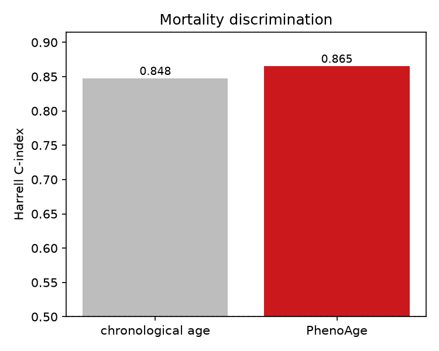
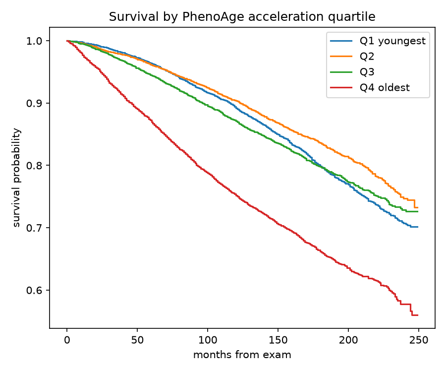

# NHANES PhenoAge and Mortality Dashboard

Builds a biological-age score (Levine PhenoAge) from nine routine blood labs and
tests whether it predicts death better than chronological age, on a large public US
health survey linked to mortality records.

Version 1.0.4

## The result

In **28,510 US adults** from NHANES (1999 to 2010), with mortality follow-up through
2019 (**6,265 deaths**, median follow-up **12.9 years**), each additional year of
PhenoAge acceleration was associated with a **4.5 percent higher rate of death,
independent of chronological age** (hazard ratio 1.044, 95 percent CI 1.043 to
1.047). PhenoAge also out-discriminated chronological age for mortality (Harrell
C-index **0.865 vs 0.848**). The direction matches Levine 2018: a biological-age
score built from ordinary labs carries mortality information beyond the calendar.

## In plain English

No stats or clinical background needed. Step by step, with terms defined as they
appear.

**Biological age from a blood panel.** *PhenoAge* is a published formula that takes
nine standard blood-test results (things like glucose, creatinine, and a marker of
inflammation called CRP) plus your real age, and converts them into an estimated
"biological age." The idea is that two 60-year-olds can be aging at different rates,
and their routine labs carry some of that information.

**Aging faster or slower than your peers.** Subtract real age from PhenoAge and you
get *PhenoAge acceleration*: a positive number means your labs look older than your
birthday, a negative number means younger. This project measures that for tens of
thousands of people.

**The real question.** Does looking biologically older actually predict dying sooner,
beyond just being chronologically older? To answer it you need to follow people over
time and see who died, which is what the linked mortality records provide.

**Why this needs survival analysis.** Some people in the data died during follow-up;
many were still alive when records ended in 2019. You cannot simply ask "who died,"
because for the living the outcome is just unknown-so-far, a situation called
*censoring*. *Survival analysis* handles this correctly. A *Cox model* then reports a
*hazard ratio*: how much each extra year of biological-age acceleration multiplies the
risk of dying at any given time. A hazard ratio of 1.044 means 4.5 percent higher
risk per year of acceleration.

**Did biological age beat the calendar?** To check, the analysis compares how well
age alone versus PhenoAge ranks who dies first, using the *C-index* (concordance,
from 0.5 for coin-flip to 1.0 for perfect ranking). PhenoAge scored 0.865 against
age's 0.848: a real, if modest, improvement. The hazard ratio is the cleaner headline
because it already holds chronological age constant.

This is a **population-level** analysis. It is not a personal calculator: it does not
take your labs and does not estimate any individual's biological age or risk.

## How it works (technical)

PhenoAge uses the published Levine 2018 equation: a parametric (Gompertz) mortality
model over nine biomarkers plus age, mapped onto an age scale (see src/phenoage.py
for the exact coefficients and the unit conversions, which are the main source of
error). Survival analysis uses lifelines: Kaplan-Meier curves by acceleration
quartile, and a Cox proportional-hazards model adjusted for chronological age, with
the C-index comparing age-only against PhenoAge.

## What is in this repo

    run_all.py           download, score, run survival, write metrics and figures
    src/                 download/merge, PhenoAge equation, survival analysis
    app.py               population-level dashboard (Streamlit)
    data/analysis.csv    the derived, de-identified scored cohort (committed)
    results/             metrics.json and the figures

Raw NHANES and mortality files are gitignored; only the small derived analysis
cohort is committed, so the dashboard deploys without a multi-gigabyte download.

## Explore it

    pip install -r requirements.txt
    python -m streamlit run app.py

Filter by age and sex, view Kaplan-Meier survival by PhenoAge acceleration quartile,
biomarker distributions, and PhenoAge versus chronological age.

## Reproduce

    python -m venv .venv
    .venv\Scripts\python.exe -m pip install -r requirements.txt
    .venv\Scripts\python.exe run_all.py --force-download

First run pulls the NHANES cycles and the linked mortality files, scores PhenoAge,
restricts to adults (age 20+), runs survival, and writes everything.

## Limitations

The public mortality file is privacy-perturbed on a small share of records (vital
status itself is not changed). The analysis is unweighted, so it is not formally
population-representative; the NHANES survey design variables are noted but not
applied. Associations are not causal. Over this wide adult age range and long
follow-up, chronological age is already a very strong mortality predictor, which is
why the C-index gain looks modest even though the age-adjusted hazard ratio is clear.

## Glossary

- **Biomarker**: a measurable biological quantity, here a routine blood-test value.
- **PhenoAge**: a published score turning nine labs plus age into a biological age.
- **PhenoAge acceleration**: biological age minus chronological age.
- **Censoring**: when a person's final outcome is unknown because follow-up ended
  while they were alive.
- **Survival analysis**: methods for time-to-event data that handle censoring.
- **Cox model / hazard ratio**: a model whose hazard ratio says how much a factor
  multiplies the risk of the event per unit.
- **C-index (concordance)**: how well a score ranks who experiences the event first;
  0.5 is chance, 1.0 is perfect.
- **NHANES**: a large, public US health and nutrition survey.

## Citation and disclaimer

Method: Levine et al., Aging 2018. Data: NHANES 1999 to 2010 and the NCHS Public-Use
Linked Mortality Files (2019 release). Population-level research, not personal medical
advice.
